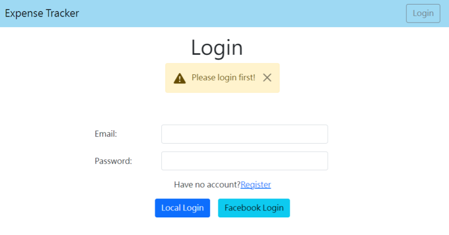
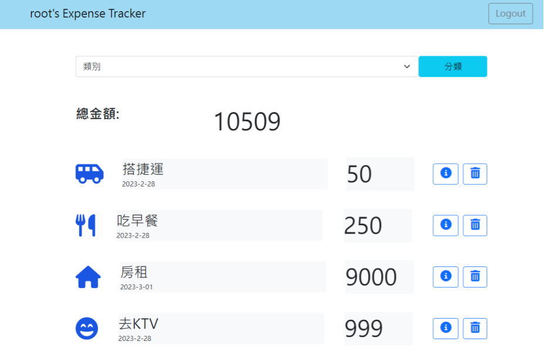

# Expense tracker




## 試用版本

已將此專案上傳至雲端伺服器，可點[此網站](https://arcane-atoll-64554.herokuapp.com/users/login)進入使用

可以自行註冊或使用下列預設帳號做使用

```
Email:root@example.com
Passport:12345678
```

## 功能

- 使用者可以註冊會員使用專屬於自己的記帳本
- 使用者可以使用Facebook登入方式省去註冊步驟並享有同樣服務
- 記帳本可以瀏覽全部或是特定項目
- 使用者可以自行增加或刪除項目
- 使用者可以自行對項目做修改

## 開始使用

1. 請先確認已安裝 node.js 與 npm (版本請見下方開發工具)
2. 經由終端機clone或下載本專案至本地資料夾

  ```
  https://github.com/chachagof/expense-tracker.git
  ```

3. 進入存放專案資料夾

  ```
  cd expense-tracker  
  ```

4. 使用 npm 指令安裝特定套件

  ```
  npm install
  ```

5.  新增`.env`檔案，並請根據`.env.example`檔案內資訊設置環境變數

6. 啟動專案前，請先確認是否已建立種子資料

  ```
  npm run seed
  ```
如在終端機中成功看見此提示表示種子資料建立成功

  ```
  SEED_USER & SEED_RECORD is done.
  SEED_CATEGORY is done.
  ```

7. 確認種子資料已建立成功，起繼續輸入以下指令進行操作

  ```
  npm run dev
  ```

8. 若在終端機看到以下提示訊息代表順利運行，於瀏覽器中輸入該網址([http://localhost:3000](http://localhost:3000))即可開始使用本網站

  ```
  Gogogo http://localhost:3000/
  MongoDB connected
  ```

9. 如需暫停，請於終端機按下ctrl + c，即可結束

## 開發套件

- Node.js 18.12.0
- Express 4.18.2
- Express-handlebars 6.0.7
- Mongoose 6.9.1
- Passport 0.6.1
- Bootstrap 5.1.3
- 其餘套件請詳見 package.json

